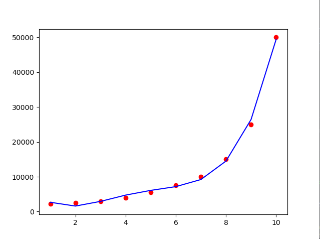

**Dots    :** dataset  
**Line    :** prediction result

# Dataset
	unvan	Egitim Seviyesi	maas
    0	Cayci	            1	2250
    1	Sekreter	        2	2500
    2	Uzman Yardimcisi	3	3000
    3	Uzman	            4	4000
    4	Proje Yoneticisi	5	5500
    5	Sef	                6	7500
    6	Mudur	            7	10000
    7	Direktor	        8	15000
    8	C-level	            9	25000
    9	CEO	                10	50000

    
# Training Data
    1	2250
    2	2500
    3	3000
    4	4000
    5	5500
    6	7500
    7	10000
    8	15000
    9	25000
    10	50000

# Test Data
    1
    2
    3
    4
    5
    6
    7
    8
    9
    10
    
# Prediction Result
    2667.83
    1588
    2932.11
    4731.64
    6086.25
    7163.75
    9200.17
    14499.7
    26434.7
    49445.8
