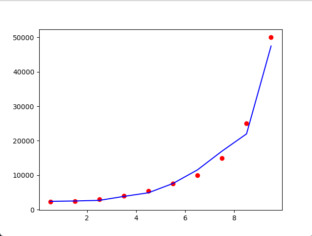

**Dots    :** dataset  
**Line    :** prediction result

# Dataset
	Egitim Seviyesi	maas
    1	            2250
    2           	2500
    3           	3000
    4           	4000
    5           	5500
    6           	7500
    7           	10000
    8           	15000
    9           	25000
    10          	50000

    
# Training Data
    1	            2250
    2           	2500
    3           	3000
    4           	4000
    5           	5500
    6           	7500
    7           	10000
    8           	15000
    9           	25000
    10          	50000

# Test Data
    1.5
    2.5
    3.5
    4.5
    5.5
    6.5
    7.5
    8.5
    9.5
    10.5
    
# Prediction Result
    2625
    2625
    3150
    3600
    5400
    7150
    9750
    14000
    23000
    42500

