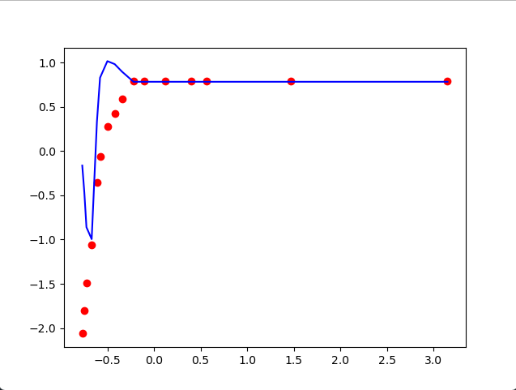

**Note**: because of weakness the model(SVR) to marginal values, test and train data have scaled!

**Dots    :** dataset  
**Line    :** prediction result

# Dataset
		zaman	sicaklik
    0	1	        0
    1	3	        9
    2	5	        20
    3	10	        35
    4	15	        60
    5	18	        70
    6	25	        82
    7	32	        87
    8	39	        93
    9	50	        100
    10	60	        100
    11	80	        100
    12	105	        100
    13	120	        100
    14	200	        100
    15	350	        100

    
# Training Data
    -0.770000906827544	-2.0628653521373024
    -0.7475396223986639	-1.805899425919507
    -0.7250783379697838	-1.4918299605422012
    -0.6689251268975838	-1.0635534168458756
    -0.6127719158253836	-0.34975917735199935
    -0.5790799891820636	-0.06424148155444886
    -0.5004654936809834	0.27837975340261173
    -0.4218509981799033	0.42113860130138697
    -0.3432365026788231	0.5924492187799173
    -0.2196994383199829	0.7923116058382026
    -0.1073930161755827	0.7923116058382026
    0.11721982811321771	0.7923116058382026
    0.3979858834742182	0.7923116058382026
    0.5664455166908186	0.7923116058382026
    1.4648968938460203	0.7923116058382026
    3.1494932260120234	0.7923116058382026

# Test Data
    -0.770000906827544	
    -0.7475396223986639	
    -0.7250783379697838	
    -0.6689251268975838	
    -0.6127719158253836	
    -0.5790799891820636	
    -0.5004654936809834	
    -0.4218509981799033	
    -0.3432365026788231	
    -0.2196994383199829	
    -0.1073930161755827	
    0.11721982811321771	
    0.3979858834742182	
    0.5664455166908186	
    1.4648968938460203	
    3.1494932260120234	
    
# Prediction Result
    -0.162575
    -0.469617
    -0.860109
    -0.994677
    0.329838
    0.830599
    1.01807
    0.98417
    0.899049
    0.784669
    0.784669
    0.784669
    0.784669
    0.784669
    0.784669
    0.784669
