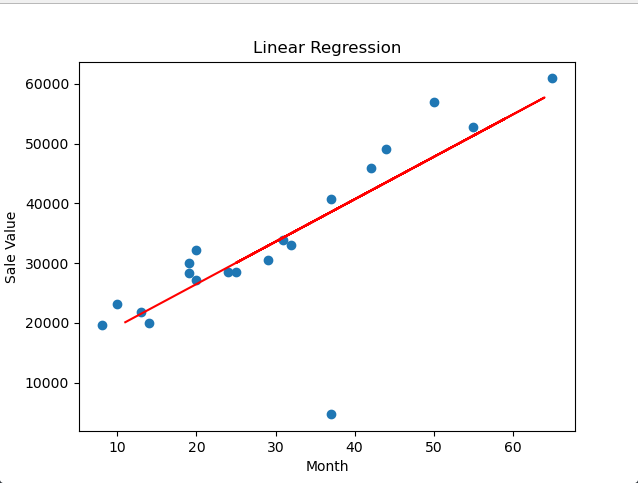

**Dots    :** dataset  
**Line    :** prediction result

# Dataset
    Aylar,Satislar
    8,19671.5
    10,23102.5
    11,18865.5
    13,21762.5
    14,19945.5
    19,28321
    19,30075
    20,27222.5
    20,32222.5
    24,28594.5
    25,31609
    25,27897
    25,28478.5
    26,28540.5
    29,30555.5
    31,33969
    32,33014.5
    34,41544
    37,40681.5
    37,4697
    42,45869
    44,49136.5
    49,50651
    50,56906
    54,54715.5
    55,52791
    59,58484.5
    59,56317.5
    64,61195.5
    65,60936
    
# Training Data
    	Aylar	Satislar
    0	8	19671.5
    1	10	23102.5
    3	13	21762.5
    4	14	19945.5
    5	19	28321.0
    6	19	30075.0
    7	20	27222.5
    8	20	32222.5
    9	24	28594.5
    12	25	28478.5
    14	29	30555.5
    15	31	33969.0
    16	32	33014.5
    18	37	40681.5
    19	37	4697.0
    20	42	45869.0
    21	44	49136.5
    23	50	56906.0
    25	55	52791.0

# Test Data
    	Aylar	Satislar
    2	11	18865.5
    28	64	61195.5
    13	26	28540.5
    10	25	31609.0
    26	59	58484.5
    24	54	54715.5
    27	59	56317.5
    11	25	27897.0
    17	34	41544.0
    22	49	50651.0
    
# Prediction Result
    20126.2
    57740.3
    30771.7
    30062
    54191.8
    50643.3
    54191.8
    30062
    36449.3
    47094.8

